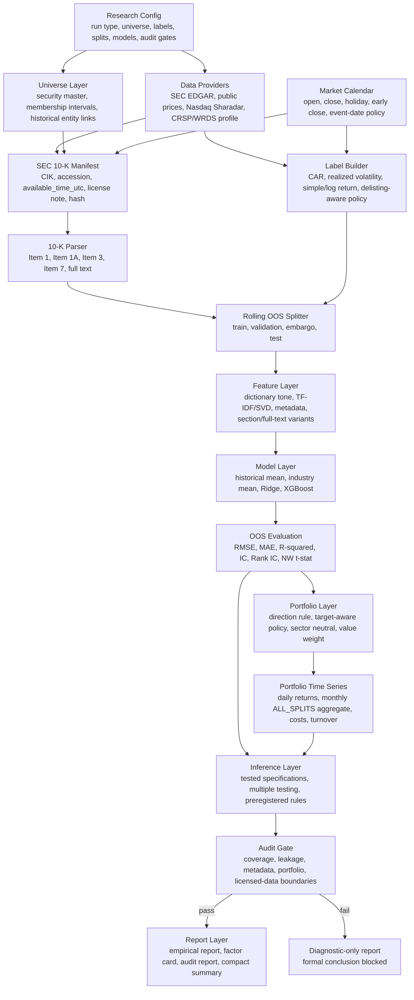
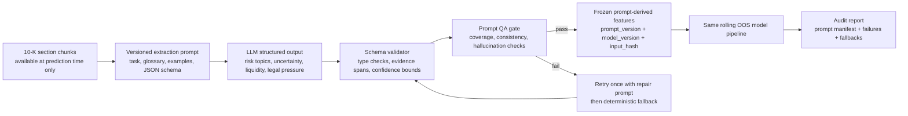
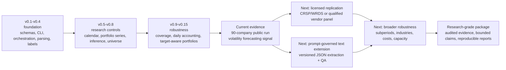

# System Architecture And Roadmap

This document describes the implemented research pipeline and the planned
prompt-governed extension. The current evidence supports out-of-sample
volatility forecasting from SEC 10-K text. It does not establish formal
tradable alpha.

## System Architecture



### Plain-Text View

```text
experiment config
  -> provider and universe validation
  -> SEC metadata + market-calendar event alignment
  -> 10-K section parsing
  -> delisting-aware labels
  -> rolling train / validation / embargo / test splits
  -> train-window-only dictionary tone + TF-IDF/SVD + metadata features
  -> historical_mean / industry_mean / Ridge / XGBoost
  -> OOS prediction metrics
  -> target-aware portfolio time series
  -> costs + sector neutrality + ALL_SPLITS monthly aggregation
  -> preregistered specification registry + multiple-testing control
  -> audit gate
  -> empirical report or diagnostic-only report
```

## Algorithm Logic

### 1. Event-Time Alignment

```text
SEC acceptance_time_utc
  -> exchange trading calendar
  -> pre-open filing      -> same trading day
  -> intraday filing      -> same trading day
  -> after-close filing   -> next trading day
  -> weekend / holiday    -> next trading day
  -> resolved event_date
```

The calendar must use the actual market close, including early-close days. The
resolved date determines the start of the forward label window.

### 2. Leakage-Safe Feature Construction

```text
train documents only
  -> fit TF-IDF vocabulary
  -> fit optional SVD projection
  -> freeze feature transform
  -> transform validation documents
  -> transform test documents
```

Dictionary features and metadata features use the same timestamp rule:

```text
feature_available_time_utc <= prediction_time_utc
```

Any violation is an audit failure.

### 3. Model Comparison

```text
Level 0: historical_mean
  -> unconditional baseline

Level 1: industry_mean
  -> industry baseline with global fallback

Level 2: Ridge
  -> stable linear text-factor baseline
  -> alpha selected on validation only

Level 3: XGBoost
  -> nonlinear interaction model
  -> hyperparameters selected on validation only
```

The test window is used once for out-of-sample evaluation. Test metrics cannot
select features, prompts, hyperparameters, signal direction, or portfolio
variants.

### 4. Target-Aware Portfolio Construction

```text
predictions
  -> preregistered signal direction
       -> long_high_score
       -> long_low_score
       -> validation_selected
  -> target-aware policy
       -> return target: score-ranked long/short
       -> volatility target: long_low_vol or risk_scaled
  -> sector-neutral / value-weight variants
  -> daily holdings and turnover
  -> gross return - transaction cost
  -> monthly ALL_SPLITS OOS return series
```

The primary portfolio p-value is based on the `ALL_SPLITS` out-of-sample return
series, not on a single favorable split.

### 5. Statistical Inference

```text
all tested specifications
  -> specification registry
  -> raw p-values
  -> multiple-testing adjustment
  -> Newey-West inference for overlapping return horizons
  -> preregistered primary rule evaluation
  -> supported / exploratory / blocked conclusion
```

## Prompt-Governed Extension

The production research path is deterministic by default. LLM prompts should
enter only as auditable feature-extraction or report-assistance modules. They
must never receive forward labels, test returns, or undisclosed test metrics.



### Prompt Roles

| Prompt role | Input | Output | Hard rule |
| --- | --- | --- | --- |
| Section extraction | One 10-K section chunk | Structured risk-topic JSON | Preserve evidence span and source hash |
| Tone classification | Evidence-bounded sentence set | Tone, uncertainty, intensity | No external company knowledge |
| QA critic | Source chunk plus proposed JSON | Validated or rejected JSON | Reject unsupported claims |
| Report assistant | Audited artifacts only | Draft interpretation | Must separate supported, exploratory, and blocked claims |

### Prompt Optimization Strategy

```text
prompt template v1
  -> define narrow financial task
  -> require JSON schema
  -> require source evidence spans
  -> add representative train-only examples
  -> run parser reliability checks
  -> compare validation-only feature utility
  -> inspect failure taxonomy
  -> revise prompt
  -> freeze prompt_version before test evaluation
  -> register prompt hash and model version
```

Optimization rules:

1. Use train and validation documents only while revising prompts.
2. Keep temperature at `0` for extraction runs unless the experiment explicitly
   preregisters a different setting.
3. Store `prompt_version`, `prompt_sha256`, `model_version`, `chunk_policy`,
   `created_at_utc`, and input hashes in a prompt manifest.
4. Require structured JSON outputs and validate them before feature generation.
5. Record retries, rejected outputs, missing evidence spans, and deterministic
   fallback usage.
6. Freeze prompt and model versions before the test window is scored.
7. Treat every prompt variant as a tested specification for multiple-testing
   disclosure.
8. Allow the Report Agent to summarize audited artifacts only; it cannot
   upgrade an exploratory result into a formal conclusion.

## Agent Responsibilities

```text
Controller Agent
  -> reads config
  -> checks prerequisites
  -> executes stages
  -> persists run status
  -> blocks formal reporting after failed audit

Data Agent
  -> builds manifests
  -> records provider, license, timestamp, and hashes

Parsing Agent
  -> extracts SEC sections
  -> stores section spans and parser failures

Feature Agent
  -> fits train-only transforms
  -> emits feature and prompt manifests

Label Agent
  -> aligns prices, benchmarks, calendars, and delisting policy

Model Agent
  -> tunes on validation only
  -> emits OOS predictions and tuning logs

Portfolio And Inference Agent
  -> constructs OOS portfolios
  -> applies costs, neutrality, aggregation, and multiple testing

Audit Agent
  -> verifies coverage, leakage, metadata, and research-grade boundaries

Report Agent
  -> produces evidence-bounded summaries from audited artifacts
```

## Roadmap



| Stage | Status | Deliverable | Gate |
| --- | --- | --- | --- |
| Pipeline foundation | Complete | Config-driven SEC-to-report workflow | Smoke tests and schema checks |
| Leakage and inference controls | Complete | Calendar alignment, train-only fitting, registry, multiple testing | Audit pass |
| Public 90-company experiment | Complete | Compact volatility evidence summary | Exploratory/applied-grade only |
| Licensed replication | Next | Survivorship-free universe, entity links, delisting-aware prices | Licensed-data manifest pass |
| Prompt-governed extraction | Next | Versioned prompt manifest, structured LLM factors, QA fallback | Prompt audit and validation-only freeze |
| Broader empirical robustness | Next | Subperiod, industry, cost, capacity, and ablation tables | Preregistered robustness report |

## Claim Boundary

```text
current supported claim
  -> 10-K textual information contains out-of-sample information about future
     realized volatility

current unsupported claim
  -> the project has established formal cost-adjusted tradable alpha

next evidence threshold
  -> licensed survivorship-free replication
  -> portfolio robustness after costs and neutrality
  -> multiple-testing-adjusted significance
  -> frozen prompt/model versions for any LLM-derived feature
```
